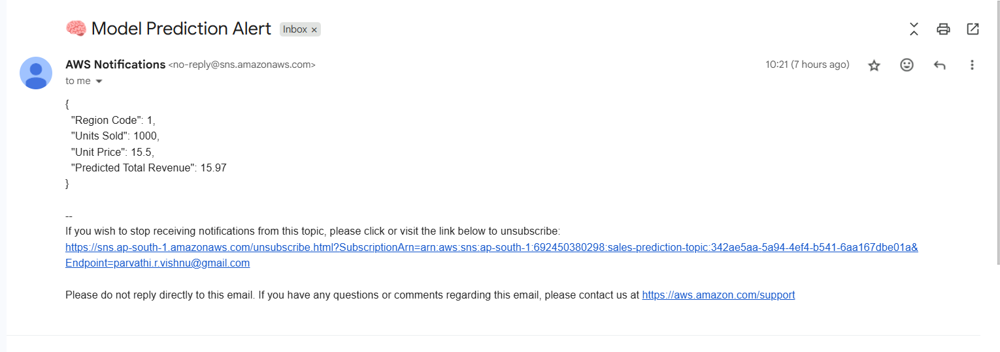

# 📊 Sales Forecasting using XGBoost on AWS SageMaker (with HTTP API & Postman Integration)

I have used machine learning with the XGBoost algorithm to predict total revenue region-wise. Here's a look into our architecture:

## 🧩 System Architecture


---

## 📌 Overview

This project demonstrates an **end-to-end machine learning deployment pipeline** using AWS services including:

- **Amazon SageMaker** for training and hosting an XGBoost model  
- **Amazon Lambda** to invoke the SageMaker endpoint and trigger SNS  
- **Amazon API Gateway (HTTP API)** to expose the model as an API  
- **Amazon SNS** for email notification  
- **Postman** to test the deployed endpoint  

---

## 🧠 Model Details

- **Algorithm**: XGBoost Regressor  
- **Dataset**: `sales_dataset.csv`  
- **Target Variable**: `Total Revenue`  
- **Features Used**: Region, Units Sold, Unit Price, etc.  

---

## 📁 Folder Structure

```
project-root/
│
├── region-sales.ipynb           # SageMaker training notebook
├── lambda_function.py           # Lambda function code
├── sales_dataset.csv            # Input dataset
├── Architecture.jpeg            # Architecture diagram
└── README.md                    # Project readme
```

---

## 🚀 Step-by-Step Instructions

### 🔹 Step 1: Upload Dataset to S3

1. Go to the **S3 console**.  
2. Create a bucket (e.g., `sales-bucket-rec`).  
3. Upload `sales_dataset.csv` to the bucket.  

### 🔹 Step 2: Train the Model in Amazon SageMaker

1. Open a SageMaker Notebook instance.  
2. Run `region-sales.ipynb` to:  
   - Load data from S3  
   - Preprocess the dataset  
   - Train an XGBoost model  
   - Deploy it as a **SageMaker endpoint**  

### 🔹 Step 3: Create a Lambda Function

1. Go to the AWS Lambda Console.  
2. Create a function (e.g., `InvokeSageMakerAndNotify`).  
3. Add the `lambda_function.py` code to the function:  
   - Invokes the SageMaker endpoint  
   - Parses the prediction  
   - Sends the result to SNS  

**Example Lambda Snippet**:
```python
import boto3
import json

sm_runtime = boto3.client('sagemaker-runtime')
sns_client = boto3.client('sns')

# 🔁 Replace these with your actual values
ENDPOINT_NAME = 'sagemaker-xgboost-2025-06-17-04-43-52-396'
SNS_TOPIC_ARN = 'arn:aws:sns:ap-south-1:692450380298:sales-prediction-topic'

def lambda_handler(event, context):
    try:
        # Step 1: Parse JSON body from API Gateway
        body = json.loads(event['body'])
        region = body['region']
        units_sold = body['units_sold']
        unit_price = body['unit_price']

        # Step 2: Prepare CSV input for SageMaker model
        revenue_calc = units_sold * unit_price  # Optional: include if your model was trained with this
        input_csv = f"{region},{units_sold},{unit_price},{revenue_calc}"

        # Step 3: Invoke the SageMaker model
        response = sm_runtime.invoke_endpoint(
            EndpointName=ENDPOINT_NAME,
            ContentType='text/csv',
            Body=input_csv
        )

        # Step 4: Decode prediction
        prediction = float(response['Body'].read().decode('utf-8').strip())
        rounded_prediction = round(prediction, 2)

        # Step 5: Send SNS notification
        message = {
            "Region Code": region,
            "Units Sold": units_sold,
            "Unit Price": unit_price,
            "Predicted Total Revenue": rounded_prediction
        }

        sns_client.publish(
            TopicArn=SNS_TOPIC_ARN,
            Message=json.dumps(message, indent=2),
            Subject="🧠 Model Prediction Alert"
        )

        # Step 6: Return success response
        return {
            "statusCode": 200,
            "headers": {"Content-Type": "application/json","Access-Control-Allow-Origin": "*"},
            "body": json.dumps({"predicted_total_revenue": rounded_prediction})
        }

    except Exception as e:
        # Optional: SNS error alert
        sns_client.publish(
            TopicArn=SNS_TOPIC_ARN,
            Message=f"🚨 Error occurred in Lambda prediction:\n{str(e)}",
            Subject="Lambda Error in Model Prediction"
        )

        return {
            "statusCode": 500,
               "headers": {
                            "Content-Type": "application/json",
                            "Access-Control-Allow-Origin": "*"
                             },
            "body": json.dumps({"error": str(e)})
        }


```

### 🔹 Step 4: Create an SNS Topic

1. Go to the **SNS Console**.  
2. Create a topic (e.g., `sales-prediction-topic`).  
3. Subscribe your email and confirm via inbox.  

### 🔹 Step 5: Setup API Gateway (HTTP API)

1. Open API Gateway → **Create HTTP API**  
2. Create a route (e.g., `POST /predict`)  
3. Integrate with Lambda  
4. Deploy the API and note the **Invoke URL**  

### 🔹 Step 6: Test the API Using Postman

- **Headers**:
```json
Content-Type: application/json
```

- **Body**:
```json
{
  "Region": 1,
  "Units Sold": 1000,
  "Unit Price": 15.5
}
```

- **Response**:
```json
{
  "prediction": 15.97
}
```

---

## ✉️ Email Notification

Once the Lambda function is triggered, an email with the prediction result will be sent via Amazon SNS.




---

## 📎 Useful Tips

- Ensure correct IAM permissions for SageMaker, SNS, and Lambda.  
- Use CloudWatch Logs for debugging Lambda issues.  
- Enable CORS in API Gateway for web apps.

---

## 📬 Contact

Raise issues or contribute to this repo if you'd like to improve or extend the project.

