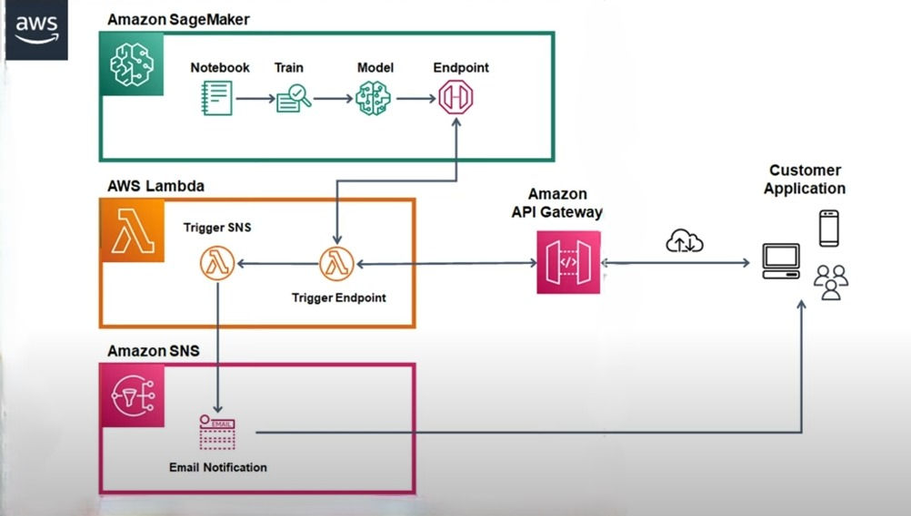

# 📊 Sales Forecasting using XGBoost on AWS SageMaker (with HTTP API & Postman Integration)

I have used machine learning with the XGBoost algorithm to predict total revenue region-wise. Here's a look into our architecture:

## 🧩 System Architecture

